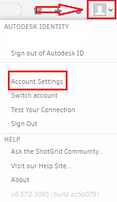
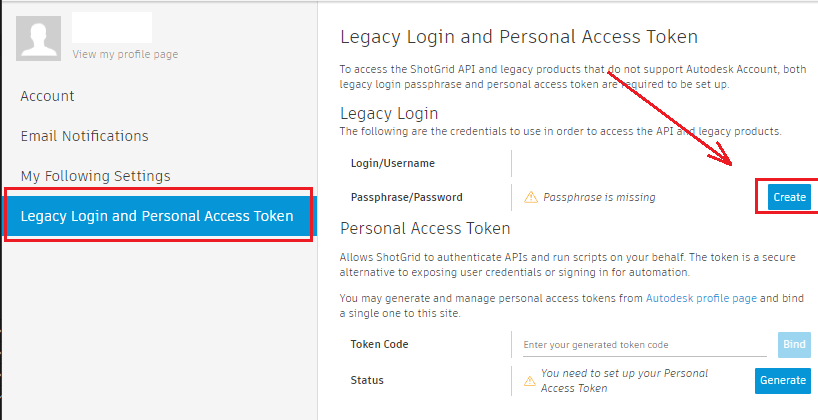
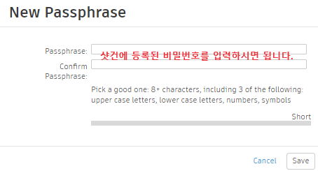
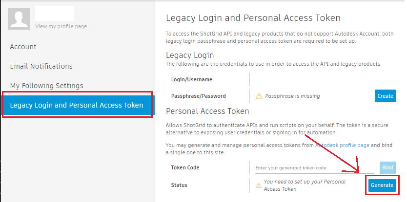
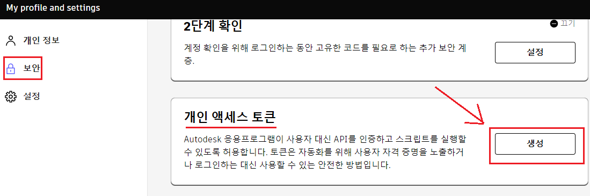
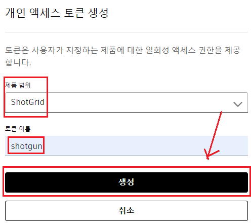
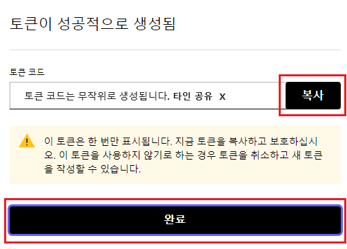
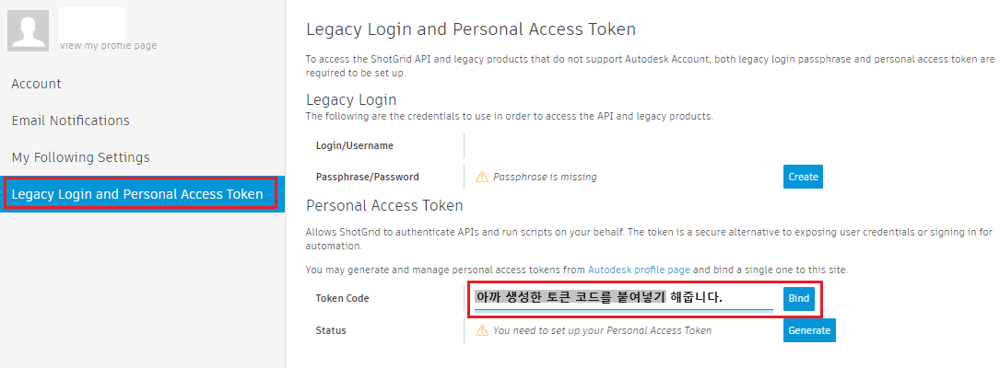
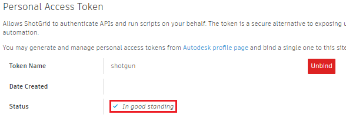
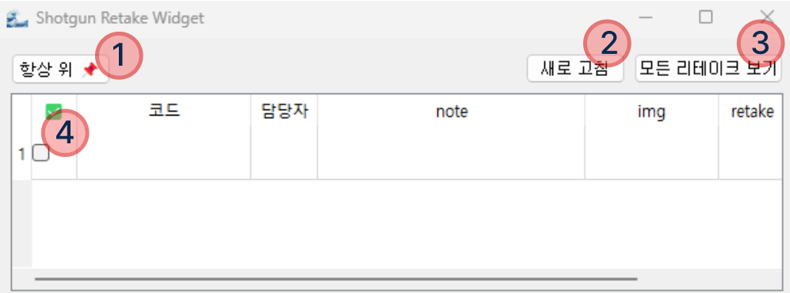

# shotgun_widget

_2023.11.24 ~_

> shotgun_api3에서 데이터를 fetching해와 retake 사항을 table 형태로 보고 업데이트할 수 있는 위젯입니다.

> - [🎉 초기 셋팅](#--------)
> - [👀 위젯 UI](#------ui)
> - [🔎 기능](#-----)
>   - [체크박스 선택 시 자동으로 wfr 변경](#---------------wfr---)
>   - [20분 간격으로 새로운 retake있는지 확인 후 알람 기능](#20-----------retake--------------)
>   - [내 리테이크 뷰 / 모든 리테이크 보기 뷰](#-----------------------)
>   - [Retake 업데이트 기능](#retake--------)
>   - [Always on Top](#always-on-top)
>   - [Auth 예외 처리](#auth------)
> - [🏷️ Stack](#----stack)

# 🎉 초기 셋팅

> 초기 셋팅임으로 셋팅이 모두 완료됐다면 더 이상 하지 않아도 됩니다.

1. shotgun Legacy Login password 셋팅

2. Access token 발급 및 개인 계정에 bind

 **a. Access token 발급**

> 📌 주의
>   토큰 코드는 타인에게 공유해서는 안되며, 복사해서 가지고 있어야 합니다.
> 만일 토큰 코드를 분실했다면, 재발급 받습니다.

 **b. 계정에 Access Token Bind**

In good standing으로 뜨면 성공적으로 bind된 것입니다.

3. .env 파일 수정

1. 폴더에 포함된 `.env`파일을 메모장으로 엽니다.
2. `LOGIN`, `PASSWORD` 부분을 자신의 샷건 아이디와 비밀번호를 적어줍니다.
   - 이때 쌍따옴표 `(")`를 삭제해서는 안됩니다.
3. `.env`파일을 저장합니다.

4.`widget.exe` 실행

# 👀 위젯 UI

1. Always on Top 기능 Toggle 버튼
2. Retake 사항을 업데이트 받을 수 있는 버튼
3. 기본은 내 리테이크만 볼 수 있는 뷰입니다. `모든 리테이크 보기` 버튼을 누를 시, 모든 분의 리테이크 사항을 볼 수 있는 뷰로 전환되는 버튼
4. 체크박스를 선택하면 자동으로 해당 리테이크를 `wfr`로 변경해줍니다.

 

# 🔎 기능

### 체크박스 선택 시 자동으로 wfr 변경

### 20분 간격으로 새로운 retake있는지 확인 후 알람 기능

### 내 리테이크 뷰 / 모든 리테이크 보기 뷰

### Retake 업데이트 기능

### Always on Top

### Auth 예외 처리

| ERROR 이름                                                                                     | 상황                                                                                   |
| ---------------------------------------------------------------------------------------------- | -------------------------------------------------------------------------------------- |
| env 파일의 LOGIN/PASSWORD가 모두 공란입니다.                                                   | [시작 탭](#🎉-초기-셋팅)에서 `3. .env 파일 수정 - 2번 항목`을 참고해주세요.             |
| 레거시 로그인 비밀번호를 발급 받아주세요. 혹은 env에서 LOGIN/PASSWORD가 틀렸는지 확인해주세요. | [시작 탭](#🎉-초기-셋팅)에서 `1. shotgun Legacy Login password 셋팅`을 참고해주세요.    |
| access token 발급 및 바인드 해주세요.                                                          | [시작 탭](#🎉-초기-셋팅)에서 `2. Access token 발급 및 개인 계정에 bind`을 참고해주세요. |
| .env 파일의 아이디 혹은 비밀번호가 공란입니다.                                                 | [시작 탭](#🎉-초기-셋팅)에서 `3. .env 파일 수정`을 참고해주세요.                        |

 

# 🏷️ Stack

 and library

